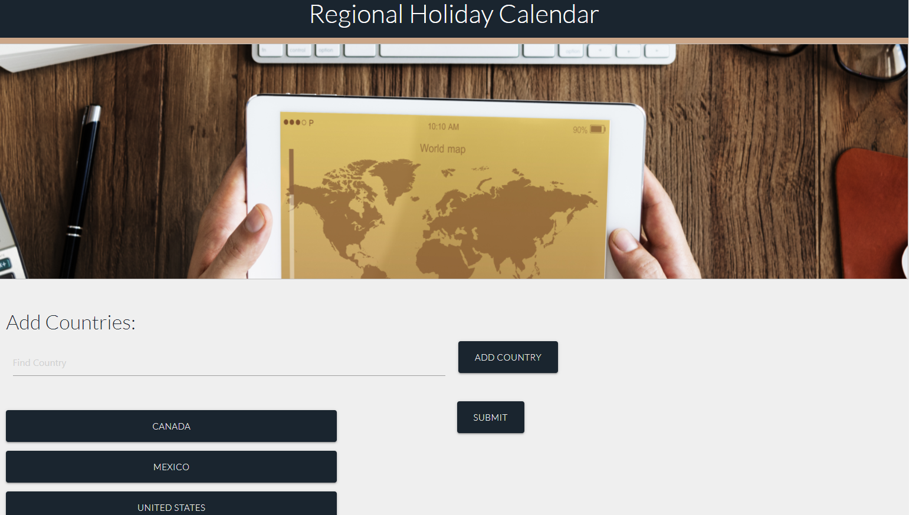
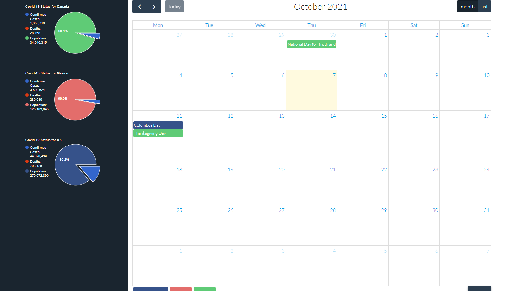

AS AN International Traveler  
I WANT to be able to see what's going on in the countries that I'm traveling to.  
SO THAT I can plan accordingly.    
  
GIVEN a site with country inputs  
WHEN I enter a country  
THEN It's added to a list of selected countries  
WHEN I submit  
THEN I am taken to a page with a calendar that shows all the holidays for those countries. And the Covid data for them.  
WHEN I select a different month  
THEN the new month is displayed.    
  
https://lemelisk27.github.io/country-holiday/  
  
Homepage  
  
  
Calendar  
